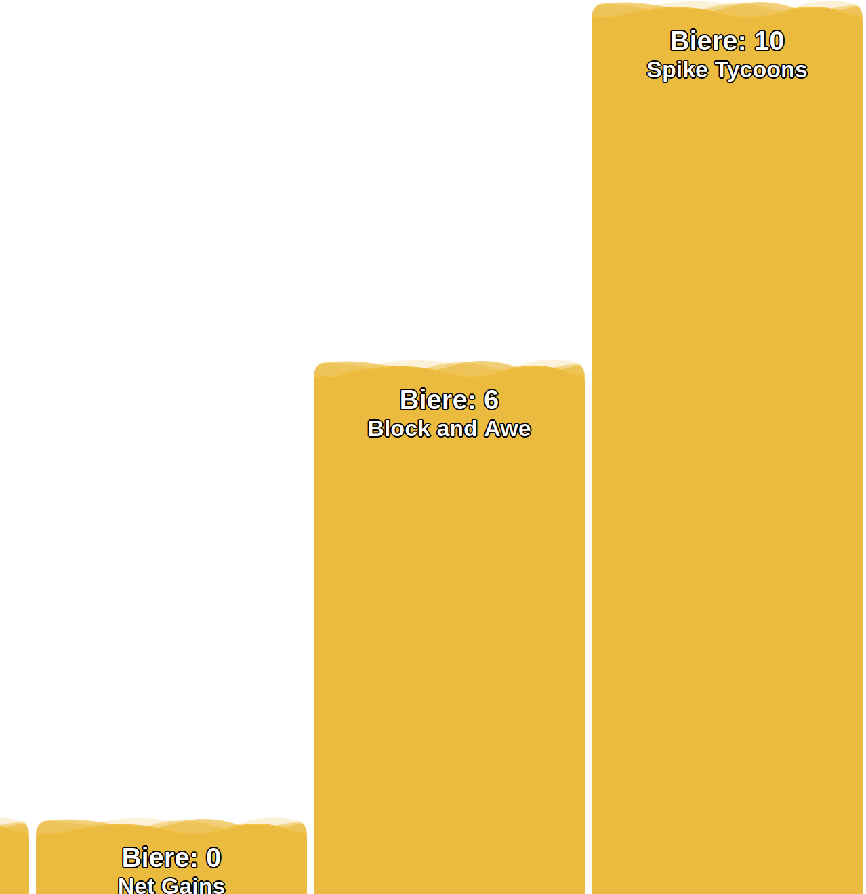

# Beer-o-Meter

## Front Page

 

## Backend Page

.png)

 

## "Add Beer" Page

.png)

## Installation

1. Install Webserver + MySQL database ([XAMPP](https://www.apachefriends.org/download.html) for example is a good option)
2. Copy content of this Repo into `htdocs`-Folder (Windows: `C:\xampp\htdocs`; Linux: `/opt/lampp/htdocs`)
3. Open [https://localhost/createDBScheme.php](https://localhost/createDBScheme.php) to create a Database. If you use a external database please edit credentials and URL in the file: `php_includes/db_connect.php`

## Usage

Open [https://localhost](https://localhost) to open the **Frontend Page**. On this page you can monitor witch team has drank the most beer. Click anywhere on the screen to get redirected to the Backend.

On the **Backend Page** [https://localhost/backend.php](https://localhost/backend.php) you can add/remove Teams and add/remove persons to this teams. Each person gets is own QR-Code.

On the **"Add Beer" Page** [https://localhost/beer.php](https://localhost/beer.php) you can add beer to persons. You can use a connected Barcode-Scanner to scan the QR-Code of the Person you want to add a beer or you can copy the `QR-Code Value` from the table of the **Backend Page**.

## DB Scheme

.png)