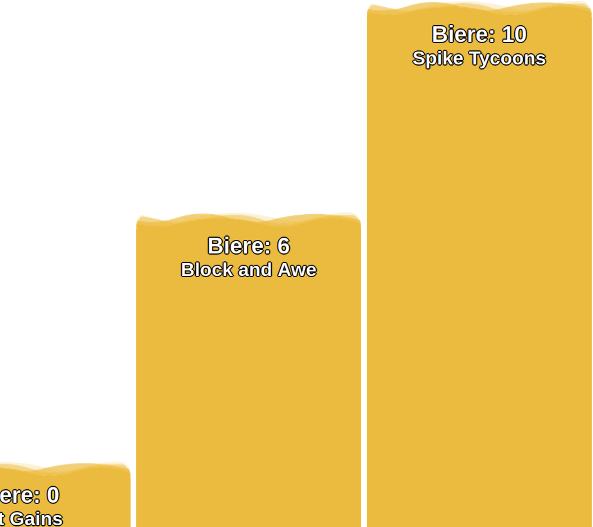

# Beer-o-Meter

Beer-o-Meter is a website where several teams compete against each other. It's all about drinking. In a block diagram, the number of drinks drunk by each team is compared and displayed in a bar chart.

## Frontend Page

 

## Backend Page

 

## "Print QR-Codes" Page

 

## "Add Beer" Page

## Installation

### Local

1. Install Webserver + MySQL database ([XAMPP](https://www.apachefriends.org/download.html) for example is a good option)
2. Copy content of this Repo into `htdocs`-Folder (Windows: `C:\xampp\htdocs`; Linux: `/opt/lampp/htdocs`)
3. Open [http://localhost/createDBScheme.php](http://localhost/createDBScheme.php) to create a Database and the right tables.
   If you use a external database please edit credentials and URL in the file: `php_includes/db_connect.php`

### Docker Compose

1. Deploy [docker-compose.yml](docker-compose.yml).

   **!!! Change the `MYSQL_ROOT_PASSWORD` password !!!**

2. Copy content of this Repo into the persistent volume of the php:apache Container.
3. Please edit the following file `php_includes/db_connect.php`, add the `MYSQL_ROOT_PASSWORD` and uncommit the line below the comment
   `// Deployment as Docker container`.
4. Open [http://\<IP-address-of-container\>:8081/createDBScheme.php](http://IP-address-of-container:8081/createDBScheme.php) to create a Database and the right tables.

## Usage

Open [https://localhost](https://localhost) to open the **Frontend Page**. On this page you can monitor witch team has drank the most beer. Click anywhere on the screen to get redirected to the Backend.

On the **Backend Page** [https://localhost/backend.php](https://localhost/backend.php) you can add/remove Teams and add/remove persons to this teams. Each person gets is own QR-Code.

On the **"Add Beer" Page** [https://localhost/beer.php](https://localhost/beer.php) you can add beer to persons. You can use a connected Barcode-Scanner to scan the QR-Code of the Person you want to add a beer or you can copy the `QR-Code Value` from the table of the **Backend Page**.

## DB Scheme

### Options-Table

| ID  | value                    | desscription                                                                                                                                |
| :-- | :----------------------- | :------------------------------------------------------------------------------------------------------------------------------------------ |
| 1   | oneToOne / oneToTeamSize | Calculation method how many point each team gets per beer. **OneToOne: 1 Beer = 1 Point** ------------- **oneToTeamSize: 1 Beer / number of team members = 0,XX Points** |
